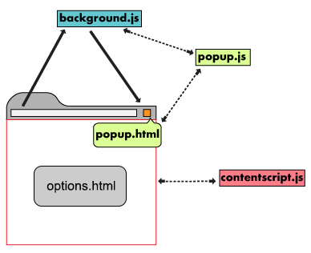
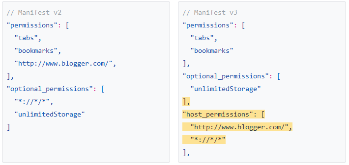
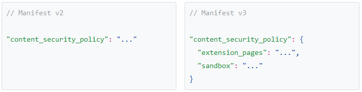
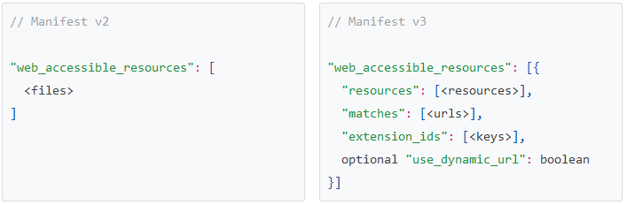

Chrome浏览器插件开发<sup>shine</sup>

课程介绍：介绍Chrome插件功能，开发插件的基础知识
课程目标：掌控基本的Chrome插件知识
适合人群：前端工程师、插件爱好者

#### 什么是Chrome插件
    严格来讲，我们说的东西应该叫Chrome扩展(Chrome Extension)，真正意义上的Chrome插件是更底层的浏览器功能扩展，需要对浏览器源码有一定掌握才有能力去开发。Chrome插件的叫法只是大家已经习惯而已。
    Chrome插件是一个用Web技术开发、用来增强浏览器功能的软件，它其实就是一个由HTML、CSS、JS、图片等资源组成的一个.crx后缀的压缩包.
    另外，其实不只是前端技术，Chrome插件还可以配合C++编写的dll动态链接库实现一些更底层的功能(PPAPI)
>Extensions are software programs, built on web technologies (such as HTML, CSS, and JavaScript) that enable users to customize the Chrome browsing experience.

####　Chrome插件能做什么

增强浏览器功能，轻松实现属于自己的`定制版`浏览器，等等。Chrome插件提供了很多实用API供我们使用，包括但不限于：
- tab控制；
- 书签控制；
- 下载控制；
- 窗口控制；
- 网络请求控制，各类事件监听；
- 自定义原生菜单；
- 完善的通信机制；
- 等等；


### Chrome扩展应用开发

####　Manifest文件格式
[Manifest文件说明](base/manifest.json)
- [示例base/hello-world-1](base/hello-world-1)
- [示例base/hello-world-2](base/hello-world-2)
####　Popup页面
- [示例base/popup](base/popup)

popup页面会根据内容自动显示合适的大小，建议popup页面的高度最好不要超过500像素。
####　常驻后台
- 示例[base/background](base/background)

background可以包含三种属性，分别是scripts、page和persistent属性。如果指定了scripts属性，则Chrome会在扩展启动时自动创建一个包含所有指定脚本的页面；如果指定了page属性，则Chrome会将指定的HTML文件作为后台页面运行。通常我们只需要使用scripts属性即可。persistent属性表示是否一直在后台运行，默认是true。建议为false，表示扩展在后台按需运行。
####　选项页面
有一些扩展允许用户进行个性化设置，这样就需要向用户提供一个选项页面。Chrome通过Manifest文件
的options_page属性为开发者提供了这样的接口，可以为扩展指定一个选项页面。
####　i18n多语言支持
- [示例base/getMessage](base/getMessage)
#### 操作用户正在浏览的页面
- [示例base/irootech](base/irootech)
####　跨域请求
- [示例base/translate](base/translate)
####　扩展页面间的通信
A、popup         chrome.extension.getViews({type:'popup'}) chrome.runtime.sendMessage chrome.runtime.connect
B、background    chrome.extension.getBackgroundPage() chrome.extension.getViews()
C、page js       chrome.tabs.query() window.postMessage
D、content_scripts   chrome.runtime.sendMessage chrome.runtime.connect chrome.tabs.sendMessage
####　储存数据
- [示例base/storage](base/storage)
localStorage
Web SQL Database
chrome.storage sync和local
fileSystem 详见《前端安全及性能培训》
####　Browser Actions
- [示例base/browserActions](base/browserActions)
####　Page Actions
- [示例base/pageActions](base/pageActions)
####　标题和 badge
- [示例base/icon-badge](base/icon-badge)
####　右键菜单
- [示例base/contextMenus](base/contextMenus)
#### 快捷键
- [示例base/commands](base/commands)
####　桌面提醒 (同上)
####　Omnibox
- [示例base/omnibox](base/omnibox)

###　管理浏览器

####　Cookies
- [示例base/cookie-clearer](base/cookie-clearer)

####　管理扩展与应用
- [示例base/management](base/management)
####　标签
- [示例base/tabs](base/tabs)
- [OneTab](https://chrome.google.com/webstore/detail/onetab/chphlpgkkbolifaimnlloiipkdnihall?hl=zh-CN)
####　Override Pages
####　书签
- [示例base/bookmark](base/bookmark)
####　历史
####　下载
- [示例base/downloads](base/downloads)
####　网络请求
- [示例base/webRequest](base/webRequest)
####　代理
- [xswitch](https://github.com/yize/xswitch)
- [SwitchyOmega](https://github.com/FelisCatus/SwitchyOmega)
####　系统信息
- [示例base/system](base/system)
### 插件案例（广告时间）
办公期间您想听歌吗？听歌又不想安装软件吧！那请使用 [SCSCMS音乐播放器](https://chrome.google.com/webstore/detail/scscms%E9%9F%B3%E4%B9%90%E6%92%AD%E6%94%BE%E5%99%A8/djkddblnfgendjoklmfmocaboelkmdkm) 插件吧，边写码边听歌！

其他　制作Chrome主题
- 示例[theme/theme](theme/theme)
[在线制作主题](https://www.themebeta.com/chrome-theme-creator-online.html)

###　MV3 Feature summary
- Service workers replace background pages.
- Network request modification is now handled with the new declarativeNetRequest API.
- Remotely hosted code is no longer allowed; an extension can only execute JavaScript that is included within its package.
- Promise support has been added to many methods, though callbacks are still supported as an alternative. (We will eventually support promises on all appropriate methods.)
- A number of other, relatively minor feature changes are also introduced in MV3.

####　MV2和 MV3区别
- manifest_version版本号不一样
- 域权限指定

- 子资源安全策略

- 统一的Action API
```javascript
// Manifest v2
{
    "browser_action": {},
    "page_action":{},
}
// Manifest v3
{
    "action": {}
}
```
- 访问资源规则

- 代码执行方式更安全
```javascript
//MV3禁止远程末经审核的代码执行。
//MV3禁止执行任何字符串代码。
function shwAlert(){}
chrome.tabs.executeScript({
    code: "alert('test!')", //MV2
    file: "const-script.js", //MV3
    function: showAlert //MV3
})
```
- Background以Service Worker方式执行
- 修改网络请求
- 弃用部分API:
    - chrome.extension.sendRequest()
    - chrome.extension.onRequest
    - chrome.extension.onRequestExternal
    - chrome.extension.lastError
    - chrome.extension.getURL()
    - chrome.extension.getExtensionTabs()
    - chrome.tabs.Tab.selected
    - chrome.tabs.sendRequest()
    - chrome.tabs.getSelected()
    - chrome.tabs.getAllInWindow()
    - chrome.tabs.onSelectionChanged
    - chrome.tabs.onActiveChanged
    - chrome.tabs.onHighlightChanged
    - chrome.extension.sendMessage()
    - chrome.extension.connect()
    - chrome.extension.onConnect
    - chrome.extension.onMessage


### scscmsmusic扩展功能
1、commands快捷键
2、comnibox输入
3、菜单抓取歌曲
4、默认一首测试歌曲


demo:http://www.kkh86.com/it/chrome-extension-doc/extensions/samples.html
